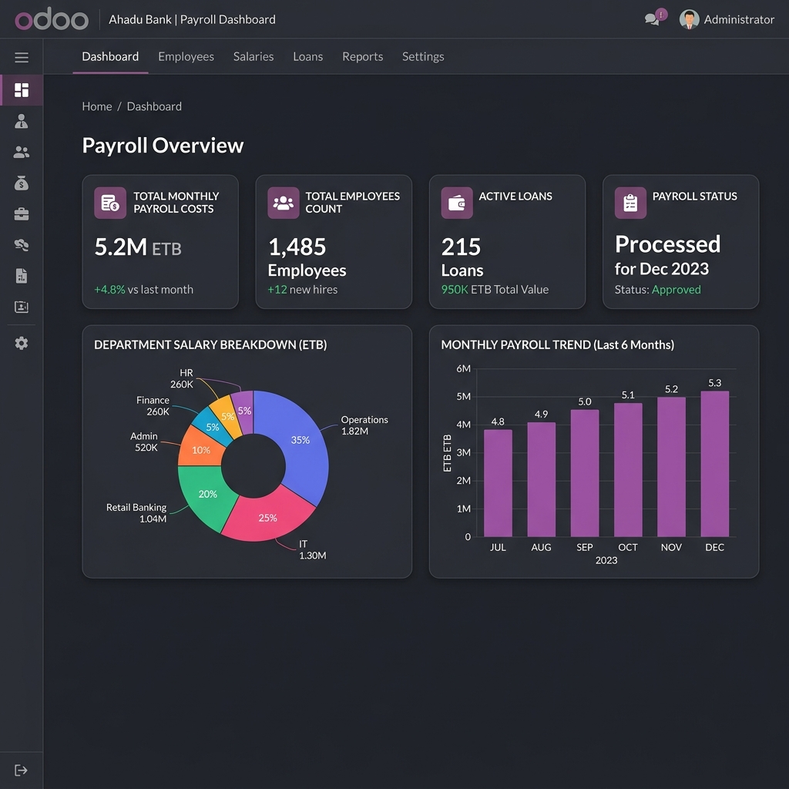
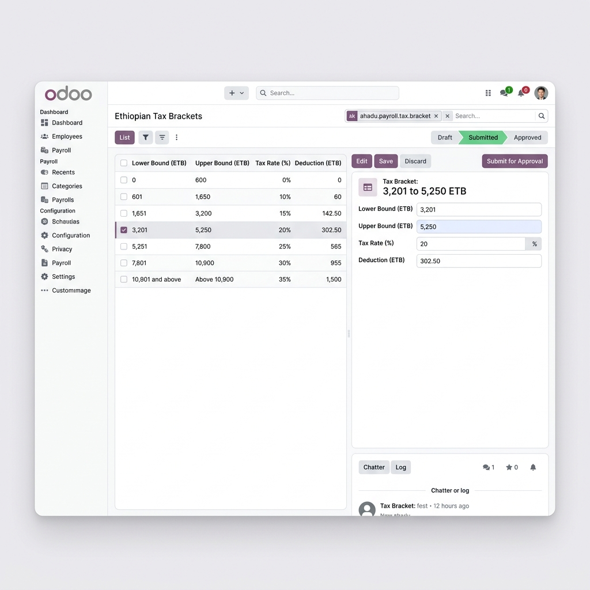
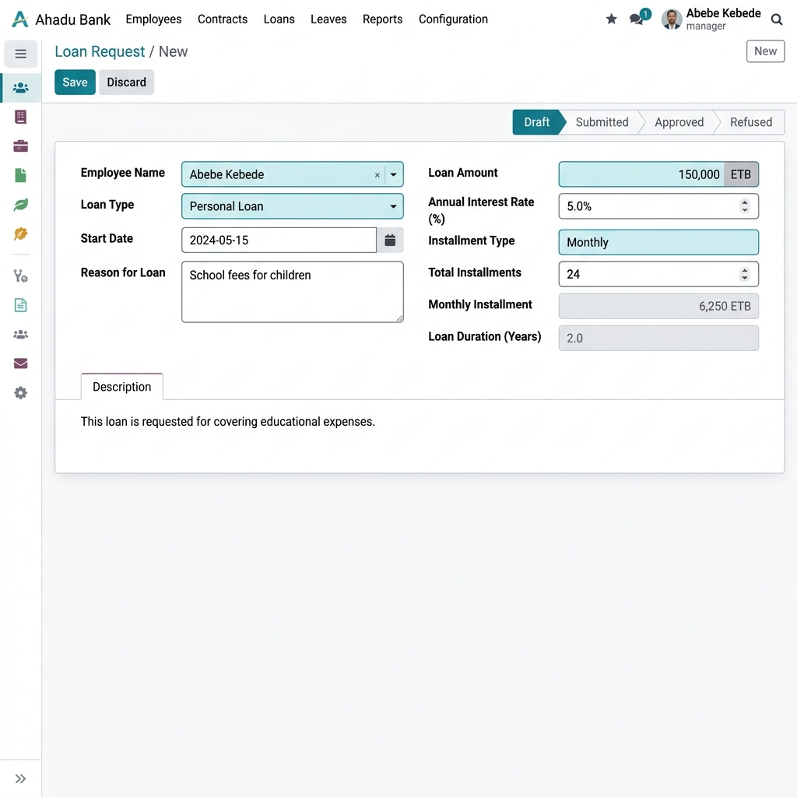
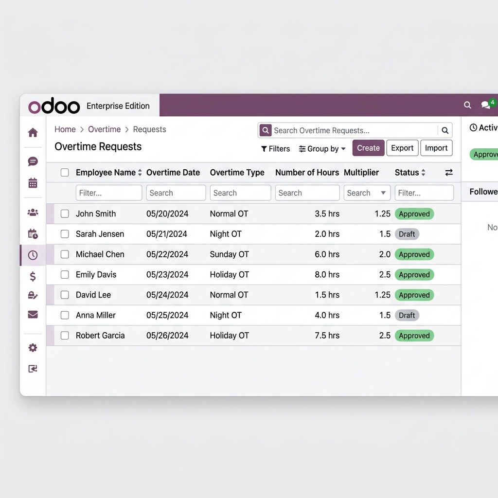

# Ahadu Bank Payroll Module Documentation

Welcome to the official documentation for the **Ahadu Bank Payroll** (`ahadu_payroll`) Odoo 18 module. This module provides a comprehensive payroll, tax, loan, and workforce compliance management solution designed specifically for Ahadu Bank S.C. in Ethiopia.

---

## Table of Contents
1. [Overview](#1-overview)
2. [Core Features & User Guide](#2-core-features--user-guide)
   - [2.1 Payroll Dashboard](#21-payroll-dashboard)
   - [2.2 Taxation & Parameter Configuration](#22-taxation--parameter-configuration)
   - [2.3 Loan Management System](#23-loan-management-system)
   - [2.4 Overtime & Attendance Integration](#24-overtime--attendance-integration)
   - [2.5 Backpay & Retroactive Adjustments](#25-backpay--retroactive-adjustments)
   - [2.6 Bonus Management](#26-bonus-management)
   - [2.7 Resignation & Termination Payslips](#27-resignation--termination-payslips)
3. [Technical Architecture & Data Models](#3-technical-architecture--data-models)
4. [Configuration & Installation](#4-configuration--installation)

---

## 1. Overview

The **Ahadu Bank Payroll** module is built on top of Odoo 18's core HR modules and the OCA base `payroll` engine. It addresses the unique regulatory, fiscal, and operational requirements of the Ethiopian banking sector. 

Key objectives of the module include:
* Full automation of Ethiopian personal income tax (PIT) calculations.
* Support for local pension contributions (Employee 7%, Employer 11%).
* Complete automation of employee loans, approval workflows, and amortization schedules.
* Streamlined management of bank-specific allowances (e.g., fuel allowance, cash indemnity).
* Backpay calculations for retroactive salary adjustments.
* Integrated resignation and termination settlement processing.

---

## 2. Core Features & User Guide

### 2.1 Payroll Dashboard

The Payroll Dashboard provides HR Managers and Finance Executives with real-time financial KPIs and visual charts illustrating payroll trends.

#### Key Dashboard Metrics:
* **Total Payroll Cost**: Total cost incurred by the bank in the active payroll period.
* **Employee Statistics**: Breakdown of active, resigned, and new contracts.
* **Loan Balances**: Total outstanding employee loans and monthly installment collection rate.
* **Department Breakdown**: Pie chart demonstrating salary allocation by department (e.g., Retail Banking, IT, Operations).

---

### 2.2 Taxation & Parameter Configuration

Ethiopian tax laws require progressive income brackets and specific handling of taxable allowances. The taxation engine is fully configurable via the **Tax Brackets** screen.

#### Standard Ethiopian Tax Brackets:
| Income Range (ETB) | Tax Rate (%) | Deduction (ETB) |
| --- | --- | --- |
| 0 - 600 | 0% | 0.00 |
| 601 - 1,650 | 10% | 60.00 |
| 1,651 - 3,200 | 15% | 142.50 |
| 3,201 - 5,250 | 20% | 302.50 |
| 5,251 - 7,800 | 25% | 565.00 |
| 7,801 - 10,900 | 30% | 955.00 |
| Above 10,900 | 35% | 1,500.00 |

#### Features:
* **Workflow Approvals**: Changes to tax configurations follow an approval process: `Draft` -> `Submitted` -> `Approved`.
* **Security Controls**: Only users within the *HR Finance Manager* group can approve or edit tax configurations in the `Approved` state.
* **Fuel and Hardship Config**: Fuel price per liter (synchronized from setting variables) and hardship rates for various regional branches.

---

### 2.3 Loan Management System

The module provides an automated employee loan management process. Employees or HR Officers can submit loan requests, structure installments, and track repayments.

#### Workflow:
1. **Draft**: Create a loan request with Employee Name, Loan Type, Principal Amount, Interest Rate, and Number of Installments.
2. **Submitted**: Sent for manager review.
3. **Approved**: Approved by the HR Manager. The amortization schedule is automatically generated.
4. **Refused**: Rejected requests (with reason wizard).

#### Automatic Deduction:
When a payslip is computed for an employee with an active loan, the system automatically pulls the current month's installment from `hr.loan` and adds a deduction rule to the payslip.

---

### 2.4 Overtime & Attendance Integration

Overtime hours are integrated with the bank's attendance verification system. 

#### Overtime Rates:
The module handles four distinct overtime types, applying standard multipliers to the hourly basic wage:
1. **Normal Overtime**: Applied for hours worked after normal shift hours (Multiplier: `1.25x`).
2. **Night Overtime**: Applied for work done between 10:00 PM and 6:00 AM (Multiplier: `1.50x`).
3. **Sunday Overtime**: Applied for weekend rest days (Multiplier: `2.00x`).
4. **Holiday Overtime**: Applied for work on official public holidays (Multiplier: `2.50x`).

---

### 2.5 Backpay & Retroactive Adjustments

In the event of delayed promotion implementations or retroactive salary increases, the **Backpay** engine allows HR to calculate the difference between what was paid and what should have been paid across a range of previous months.
* The system computes historical differences.
* Generates adjusting entries for the current payslip.

---

### 2.6 Bonus Management

Supports structured year-end or performative bonus payments.
* Configurable bonus schemes (fixed amounts or percentage of basic salary).
* Optional tax exemptions under special tax configurations.

---

### 2.7 Resignation & Termination Payslips

Special workflows handle employees leaving the bank.
* **Resignation Payslip**: Automates the calculation of notice periods, outstanding leaves, and deductions.
* **Termination Payslip**: Automates severance payments according to the Ethiopian Labour Proclamation, calculating service year multipliers.

---

## 3. Technical Architecture & Data Models

Below are the primary custom models introduced by the `ahadu_payroll` module:

* `hr.loan`: Handles loan records, tracking amounts, and state flows.
* `hr.loan.line`: Individual monthly amortization lines.
* `ahadu.payroll.tax.bracket`: Stores progressive tax tiers and deductions.
* `ahadu.payroll.tax.config`: Dashboard view linking tax brackets and fuel parameters.
* `ahadu.overtime`: Overtime request records mapped to employees.
* `ahadu.backpay`: Backpay campaign records and employee-wise computation lists.
* `cash.indemnity`: Custom cash handling risk allowance model for tellers.

---

## 4. Configuration & Installation

### Installation:
1. Copy the `ahadu_payroll` folder into your custom addons path.
2. Update the Odoo Apps list.
3. Install the module. Dependencies (`hr`, `hr_contract`, `payroll`, `ahadu_hr_leave`, `ahadu_hr`) will be installed automatically.

### Setup Steps:
1. Navigate to **Payroll > Configuration > Settings**.
2. Configure **Tax Brackets** and ensure the status is set to **Approved**.
3. Establish your **Pay Groups** and link employees.
4. Set up Odoo accounts for accounting integration under **Payroll > Configuration > Journal Entries**.
